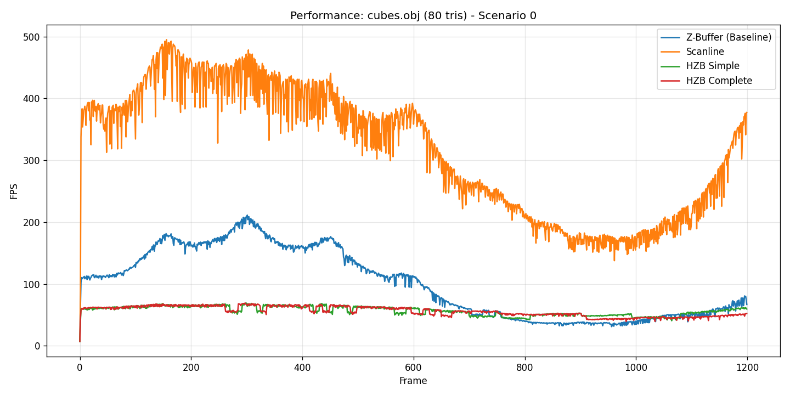
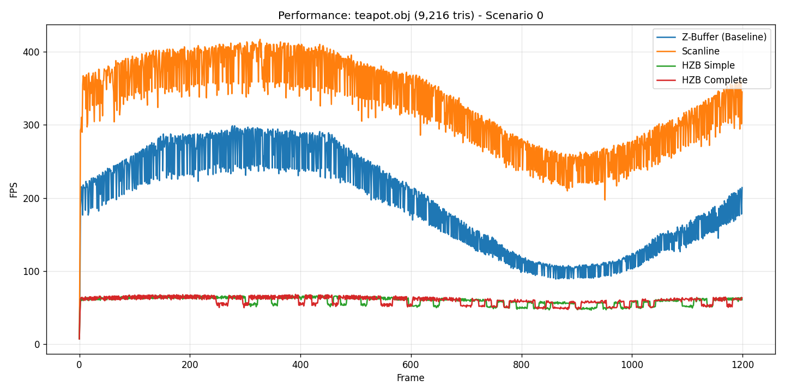
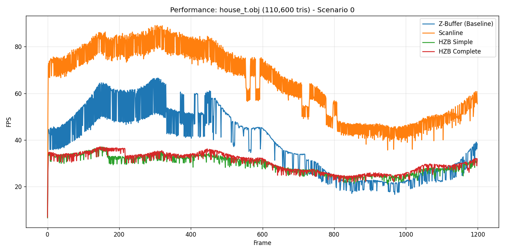
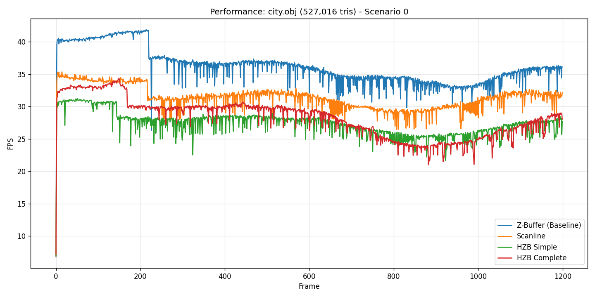
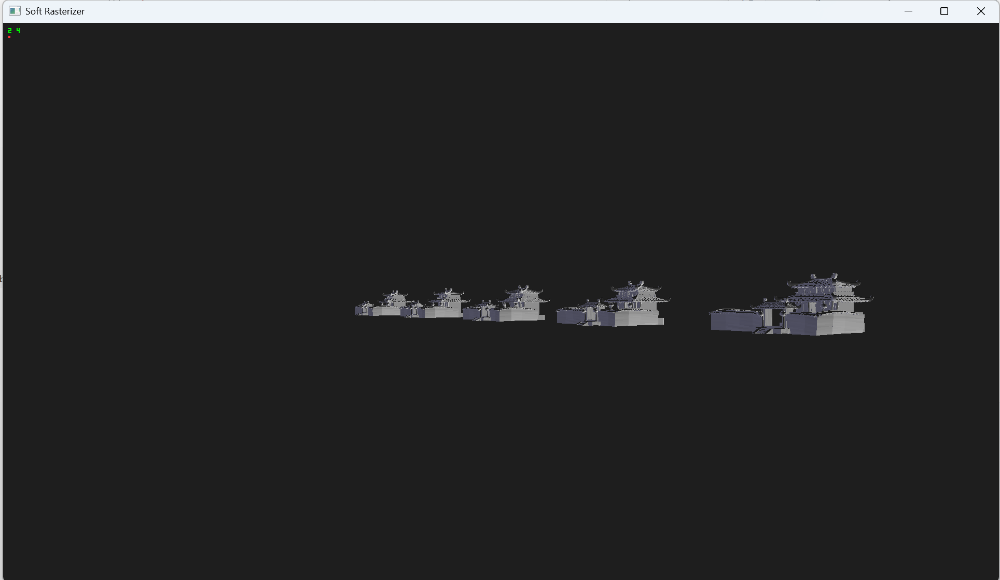

## 一、 开发环境与库依赖

本项目基于现代 C++ 标准开发，构建了一个完整的软光栅化渲染器，用于验证和对比不同的消隐算法。

- **操作系统**: Windows 10 / 11 64-bit

- **编程语言**: C++ (ISO C++17 Standard)

- **构建系统**: CMake (跨平台构建脚本)

- **图形接口**: Vulkan SDK (仅作为**显示后端**，用于将 CPU 计算的像素缓冲区提交到显存并显示，核心光栅化逻辑完全由 CPU 实现)

- **第三方库**:
    
    - **GLFW**: 负责跨平台的窗口创建、上下文管理及键盘/鼠标输入事件处理。
    
    - **OpenMP**: 用于并行计算加速，特别是在顶点变换（Vertex Transformation）和基准 Z-Buffer 的光栅化阶段。
    
    - **GLM** (内嵌实现): 代码中实现了一个轻量级的数学库 `Vec3`, `Mat4`，用于处理向量运算、矩阵变换及透视投影。

**项目部署：** 
```bash
1.编译
#本机存在msvc选择
cmake --preset windows-msvc-release
cmake --build --preset windows-msvc-release
#本机存在gcc、g++选择
cmake --preset windows-mingw-release
cmake --build --preset windows-mingw-release
#linux暂时没有进行测试和preset的设置，得自行修改一下，抱歉。
2.测试
#漫游式
#Usage: ./VulkanApp.exe model.obj [mode] [scenario] [yes/no]
#mode 1zbuffer 2 scanline zbuffer 3 hzb without bvh 4 full hzb
#scenario 0是默认场景 其他scenario更多是没有大型obj所强行通过排列补充遮挡情况，容易卡
#yes no是是否是benchmark环境 no为漫游 默认为no yes为benchmark环境 不可漫游 默认跑1200帧
#左上显示帧数 红点表示mode 几个红点表示mode几
#msvc
.\build\windows-msvc-release\VulkanApp.exe .\assets\cubes.obj 1 0 no
.\build\windows-msvc-release\VulkanApp.exe .\assets\house_t.obj 4 0 yes

#gcc
.\build\windows-mingw-release\VulkanApp.exe .\assets\cubes.obj 1 0 no
.\build\windows-mingw-release\VulkanApp.exe .\assets\house_t.obj 4 0 yes
#获得benchmark_report文件内容如下操作
#需要python环境存在matplotlib 用来绘制图像
#控制台会输出每一段的耗时计算 默认测试 scenario0
python benchmark.py
#下面容易炸 不同scenario，这里我的排列设计的不是很好 效果一般
#python benchmark.py --extreme

```
### 用户操作

程序运行后提供实时的 3D 渲染窗口，支持多种交互模式以便于观察算法效果。

#### 1. 渲染模式切换

benchmark = no(default = no)的状态下，用户可通过键盘数字键实时切换渲染算法，控制台会输出当前的帧率和算法阶段耗时：

- **`1` Standard Z-Buffer**: 标准 Z 缓冲算法（基准）。利用 OpenMP 并行加速，暴力遍历三角形包围盒。

- **`2` Scanline Z-Buffer**: 扫描线 Z 缓冲算法。利用几何连续性逐行扫描，避免了包围盒法的空像素计算。

- **`3` HZB Simple (Linear)**: 简单层次 Z 缓冲。无空间结构，线性遍历三角形，逐个查询 HZB 进行剔除。

- **`4` HZB Complete (BVH)**: **完整层次 Z 缓冲**。结合层次包围盒（BVH），实现了基于节点的整块剔除（Node Culling）。


#### 2. 漫游控制

实现了第一人称自由摄像机：

- **移动**: `W`/`S` (前后), `A`/`D` (左右), `E`/`Q` (升降)。按住 `Shift` 加速。
    
- **视角**: 按住鼠标左键拖拽旋转模型/视角，鼠标滚轮缩放视角。
    
- **动画**: `Space` 键暂停/恢复模型的自动旋转。
## 二、 算法实现与模式设计

本项目实现了四种渲染模式，旨在对比传统 Z-Buffer、扫描线算法与层次 Z-Buffer (HZB) 在不同场景下的表现。

### 1. 渲染模式定义

| **模式 ID**  | **名称**                | **对应作业要求** | **算法描述**                                                                                                                |
| ---------- | --------------------- | ---------- | ----------------------------------------------------------------------------------------------------------------------- |
| **Mode 1** | **Standard Z-Buffer** | 基准对照       | 传统的 Z-Buffer 算法。利用 OpenMP 并行计算三角形包围盒，暴力光栅化。代表了利用现代多核 CPU 算力的暴力解法。                                                       |
| **Mode 2** | **Scanline Z-Buffer** | **扫描线算法**  | 改进的光栅化算法。利用几何连续性逐行扫描，避免了空像素计算。在 CPU 单线程逻辑下效率较高，但在并行化方面不如 Mode 1 容易扩展。                                                   |
| **Mode 3** | **HZB Simple**        | **简单模式**   | **无空间结构的 HZB**。线性遍历所有三角形，逐个查询 HZB 进行剔除。流程：Depth Pre-Pass -> Build HZB -> Color Pass (Linear Cull)。                      |
| **Mode 4** | **HZB Complete**      | **完整模式**   | **HZB + 层次包围盒 (BVH)**。结合了空间划分。在渲染前，先查询 BVH 节点是否被 HZB 遮挡。流程：Depth Pre-Pass (BVH) -> Build HZB -> Color Pass (Node Cull)。 |

### 2. 核心数据结构

1. **层次包围盒 (BVH)**:
    
    - 采用递归构建，根据三角形重心在最长轴上进行划分。
    
    - **空间排序 (Spatial Sorting)**: 在渲染遍历时，始终优先访问距离摄像机最近的子节点（Front-to-Back），这是 HZB 算法能有效剔除的关键。
    
2. **层次 Z-Buffer (HZB Pyramid)**:
    
    - 采用 **Max-Pooling** 构建。第 $L$ 层像素值等于上一层对应 $2 \times 2$ 区域的最大深度值。
    
    - 允许算法以 $O(1)$ 时间复杂度查询屏幕任意矩形区域的**最保守**遮挡深度。


## 三、 实验数据与图表分析

我们在五个不同规模的 OBJ 模型上进行了测试，覆盖了从极低多边形（Cubes）到高面数复杂场景（City）。以下数据基于 **Scenario 0 (Base Scenario, 无大量遮挡/实例化)**。

### 1. 总体性能数据 (Scenario 0)

|**模型**|**面片数 (Faces)**|**Mode 1 (Z-Buf)**|**Mode 2 (Scanline)**|**Mode 3 (HZB Simple)**|**Mode 4 (HZB Complete)**|
|---|---|---|---|---|---|
|**Cubes**|80|14.12 ms|**3.21 ms**|16.86 ms|16.73 ms|
|**Teapot**|9,216|5.49 ms|**2.53 ms**|15.63 ms|15.36 ms|
|**Hut**|85,644|51.73 ms|**13.48 ms**|30.73 ms|30.31 ms|
|**House**|110,600|30.37 ms|**15.05 ms**|31.82 ms|30.87 ms|
|**City**|527,016|**24.54 ms**|28.24 ms|33.06 ms|33.11 ms|

### 2. 阶段耗时分析 (为何 HZB 变慢？)

观察数据可以发现，在简单场景（Scenario 0）下，**HZB 模式（Mode 3/4）普遍慢于基准算法**。为了深入分析原因，我们拆解了 `City.obj` (527K 面片) 的耗时结构：

- **Mode 4 (HZB Complete) 耗时拆解**:
    
    - **Pre-Pass**: 11.04 ms (33%)
        
    - **HZB Build**: 11.63 ms (35%)
        
    - **Raster**: 9.17 ms (28%)
        
    - **Other**: ~1.3 ms (4%)
        
    - **Total**: 33.11 ms
        
- **对比 Mode 1 (Z-Buffer)**:
    
    - **Raster**: 23.35 ms (95%)
        
    - **Total**: 24.54 ms
        

**分析**:

1. **固定开销 (Overhead)**: HZB 算法必须先进行深度预处理 (Pre-Pass) 和金字塔构建 (Build HZB)。在 `City` 场景中，仅这两项就消耗了 **22.67 ms**，几乎等于 Mode 1 渲染完整一帧的时间。
    
2. **光栅化收益 (Raster Gain)**: HZB 确实减少了光栅化时间（从 23.35ms 降至 9.17ms，减少了 **60%**）。这证明 HZB 的剔除机制是生效的。
    
3. **结论**: 在无严重遮挡的场景下，HZB 节省的光栅化时间不足以抵消其构建成本。这是一个经典的 **“剔除开销 vs. 渲染开销”** 的权衡问题。
    

## 四、 算法分析与空间排序的意义

### 1. 简单模式 (Mode 3) vs. 完整模式 (Mode 4)

虽然在 Scenario 0 的总耗时上两者差异不大，但在算法行为上有本质区别：

- **Mode 3 (Linear)**: 必须遍历所有 527,016 个三角形，逐个进行 HZB 查询。`Pre-Pass` 耗时 7.33ms。
    
- **Mode 4 (BVH)**: 利用 BVH 树。`Pre-Pass` 耗时 11.04ms（因为递归遍历 BVH 比线性循环更慢，且涉及大量节点包围盒计算）。
    
- **Cull Time**: Mode 4 记录了 `2.20 ms` 的 Cull 时间，这意味着它花了时间在树结构上做决策。
    

为什么 Mode 4 没有显著快于 Mode 3？

在 Scenario 0（普通视角，无大量遮挡）中，大部分物体都是可见的。BVH 无法剔除大块节点（因为节点都在屏幕内且没被遮挡），反而引入了树遍历的开销。Mode 4 的优势通常体现在 "High Depth Complexity" (高深度复杂度) 场景，例如站在一堵墙后面看整个城市，此时 Mode 4 能瞬间剔除 90% 的几何体，而 Mode 3 仍需逐个检查。

### 2. 物体空间排序 (Spatial Sorting) 的意义

在代码中，我们在遍历 BVH 时实现了 **Front-to-Back (由近及远)** 的排序逻辑：

C++

```C++
// 优先处理距离相机近的子节点
if (dLeft < dRight) { push(right); push(left); } 
else { push(left); push(right); }
```

实验意义:

HZB 是一种 保守剔除 算法。它依赖于 Z-Buffer 中已经存在的深度值来遮挡后续物体。

- **如果乱序渲染**: 算法可能先处理了远处的建筑 A。此时 Z-Buffer 是空的，A 被画了出来。接着处理近处的建筑 B。虽然 B 挡住了 A，但 A 已经画了，计算量已经浪费了。

- **空间排序后**: 算法先处理近处的建筑 B，填入较浅的深度值。当处理远处的建筑 A 时，查询 HZB 发现 A 的深度大于 B，直接剔除 A。


数据佐证:

在 City 模型中，尽管总时间变长，但 Mode 4 的 Raster 时间 (9.17ms) 远低于 Mode 1 (23.35ms) 和 Mode 2 (26.91ms)。这证明通过空间排序，我们成功利用近处的物体遮挡了远处的物体，避免了大量的像素着色计算（Overdraw）。

### 3. 扫描线算法 (Mode 2) 的表现

- **优势**: 在 `Cubes`, `Teapot`, `Hut`, `House` 等中小规模模型上，**Scanline 算法是最快的**（比 Z-Buffer 快 2-5 倍）。这是因为扫描线算法只处理三角形覆盖的有效像素，完全避免了包围盒算法中对空像素的无效遍历与测试。

- **劣势**: 在 `City` (527K 面片) 这种超大规模场景下，Scanline 的串行逻辑（难以像 Mode 1 那样简单地 OpenMP 并行化）成为了瓶颈，被暴力的并行 Z-Buffer 反超。


## 五、 结论

1. **算法效率**:
    
    - **低负载/中负载**: 扫描线 Z-Buffer (Mode 2) 效率最高，它是 CPU 软光栅化的理想选择。
        
    - **高负载 (海量面片)**: 简单的并行 Z-Buffer (Mode 1) 凭借多核优势胜出。
        
2. **HZB 的适用性**:
    
    - HZB 算法引入了显著的固定开销（Pre-Pass + Build）。在简单场景（Scenario 0）下，这种开销会导致性能下降（加速比 < 1.0）。
    
    - 然而，HZB 成功减少了 **60% 以上的光栅化时间**。这表明在 **像素着色开销极大**（如复杂 Shader）或 **遮挡极高**（如室内漫游、城市建筑群）的场景下，HZB 将从“负优化”转变为“性能救星”。
    
3. **空间排序**:
    
    - 是 HZB 算法生效的基石。没有由近及远的排序，HZB 只能作为 Z-Buffer 的一种昂贵替代品，而无法发挥其“提早剔除”的核心优势。
    

 其中我其实考虑过一些并行优化光栅化操作，但是比较容易出现数据竞争，并且最终效果并不稳定，后续再CG2 光线追踪的时候再回过头来考虑优化。

这里的最终结论有点可惜，因为我没有找到更好的比如1000k面片情况下是否会出现更显著的反超情况，后续会补充实验内容，和完善代码。
 
---
## benchmark测试：

**实验环境**:Win11\Intel(R)Core(TM)Ultra 7 265KF


以下为scenario 0 即默认排列的情况







scenario 3 mode 1 house_t.obj 仅作展示情况

```bash
(cv) C:\Users\lcknight\Desktop\CG\CGAssignment>python benchmark.py
Target Executable: C:\Users\lcknight\Desktop\CG\CGAssignment\build\windows-msvc-release\VulkanApp.exe
Scanning models in 'assets'...
Found 5 models:
  - cubes.obj            | Faces: 80
  - teapot.obj           | Faces: 9,216
  - hut_t.obj            | Faces: 85,644
  - house_t.obj          | Faces: 110,600
  - city.obj             | Faces: 527,016
--------------------------------------------------

[==================== Testing Model: cubes.obj (80 faces) ====================]

--- Stage Breakdown (Scenario 0) ---
Mode                 | Clear   | Vertex  | PrePass | HZB     | Cull    | Raster  | Total (ms) | FPS      
------------------------------------------------------------------------------------------------------   
Z-Buffer (Baseline)  | 0.86    | 0.01    | 0.00    | 0.00    | 0.00    | 13.24   | 14.12      | 100.7    
Scanline             | 0.75    | 0.00    | 0.00    | 0.00    | 0.00    | 2.46    | 3.21       | 316.5    
HZB Simple           | 0.79    | 0.01    | 1.45    | 12.48   | 0.00    | 2.12    | 16.86      | 56.7     
HZB Complete         | 0.80    | 0.01    | 1.46    | 12.45   | 0.00    | 2.01    | 16.73      | 56.0     
Saved FPS chart: benchmark_report\cubes.obj_fps.png

[==================== Testing Model: teapot.obj (9,216 faces) ====================]

--- Stage Breakdown (Scenario 0) ---
Mode                 | Clear   | Vertex  | PrePass | HZB     | Cull    | Raster  | Total (ms) | FPS      
------------------------------------------------------------------------------------------------------   
Z-Buffer (Baseline)  | 0.77    | 0.00    | 0.00    | 0.00    | 0.00    | 4.72    | 5.49       | 195.0    
Scanline             | 0.77    | 0.00    | 0.00    | 0.00    | 0.00    | 1.76    | 2.53       | 330.1    
HZB Simple           | 0.92    | 0.00    | 1.31    | 12.08   | 0.00    | 1.31    | 15.63      | 59.3     
HZB Complete         | 0.94    | 0.00    | 1.41    | 11.76   | 0.09    | 1.25    | 15.36      | 59.9     
Saved FPS chart: benchmark_report\teapot.obj_fps.png

[==================== Testing Model: hut_t.obj (85,644 faces) ====================]

--- Stage Breakdown (Scenario 0) ---
Mode                 | Clear   | Vertex  | PrePass | HZB     | Cull    | Raster  | Total (ms) | FPS      
------------------------------------------------------------------------------------------------------   
Z-Buffer (Baseline)  | 0.94    | 0.03    | 0.00    | 0.00    | 0.00    | 50.76   | 51.73      | 26.4     
Scanline             | 0.94    | 0.02    | 0.00    | 0.00    | 0.00    | 12.52   | 13.48      | 78.7  
HZB Simple           | 0.98    | 0.02    | 8.42    | 11.84   | 0.00    | 9.48    | 30.73      | 32.9  
HZB Complete         | 0.91    | 0.02    | 8.39    | 11.81   | 0.02    | 9.18    | 30.31      | 32.1  
Saved FPS chart: benchmark_report\hut_t.obj_fps.png

[==================== Testing Model: house_t.obj (110,600 faces) ====================]

--- Stage Breakdown (Scenario 0) ---
Mode                 | Clear   | Vertex  | PrePass | HZB     | Cull    | Raster  | Total (ms) | FPS      
------------------------------------------------------------------------------------------------------   
Z-Buffer (Baseline)  | 0.98    | 0.03    | 0.00    | 0.00    | 0.00    | 29.36   | 30.37      | 38.9  
Scanline             | 0.85    | 0.02    | 0.00    | 0.00    | 0.00    | 14.17   | 15.05      | 64.4  
HZB Simple           | 0.94    | 0.02    | 9.78    | 11.70   | 0.00    | 9.37    | 31.82      | 29.4  
HZB Complete         | 0.92    | 0.02    | 9.67    | 11.69   | 0.21    | 8.56    | 30.87      | 30.2  
Saved FPS chart: benchmark_report\house_t.obj_fps.png

[==================== Testing Model: city.obj (527,016 faces) ====================]

--- Stage Breakdown (Scenario 0) ---
Mode                 | Clear   | Vertex  | PrePass | HZB     | Cull    | Raster  | Total (ms) | FPS      
------------------------------------------------------------------------------------------------------   
Z-Buffer (Baseline)  | 1.04    | 0.15    | 0.00    | 0.00    | 0.00    | 23.35   | 24.54      | 36.1  
Scanline             | 1.17    | 0.15    | 0.00    | 0.00    | 0.00    | 26.91   | 28.24      | 31.4  
HZB Simple           | 1.11    | 0.18    | 7.33    | 11.63   | 0.00    | 12.82   | 33.06      | 27.3  
HZB Complete         | 1.11    | 0.16    | 11.04   | 11.63   | 2.20    | 9.17    | 33.11      | 28.2  
Saved FPS chart: benchmark_report\city.obj_fps.png

Benchmark Suite Completed.
```